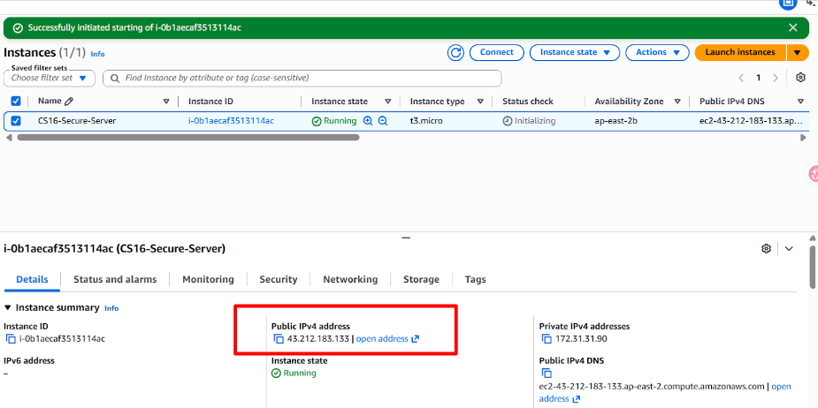
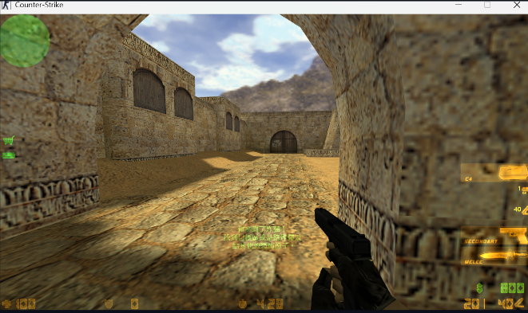
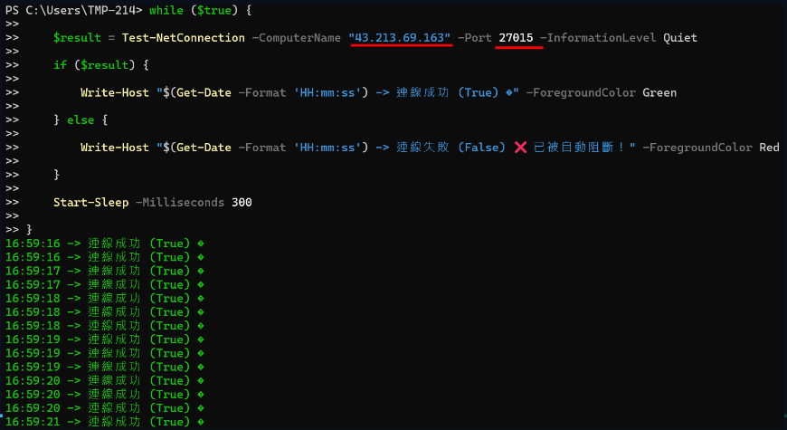
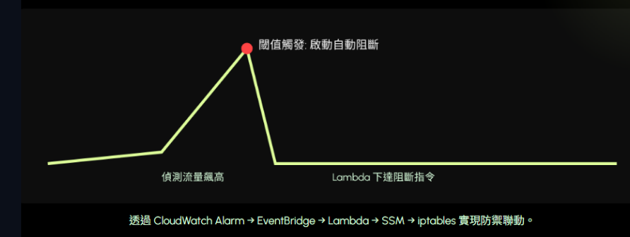
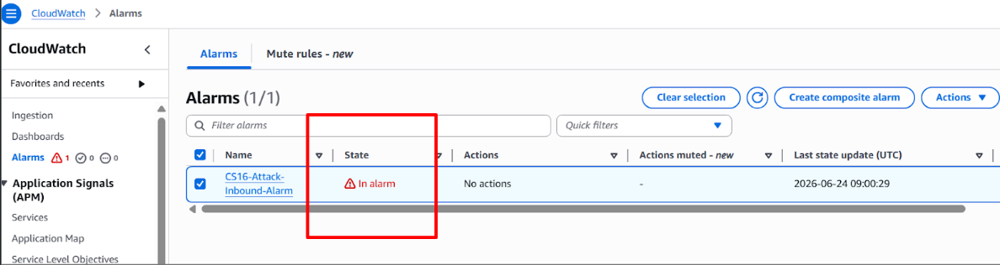
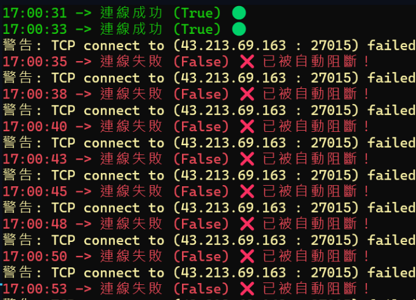
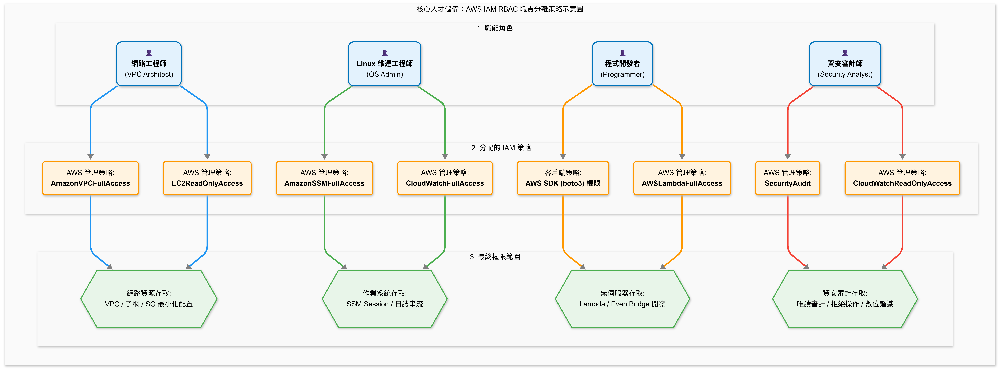
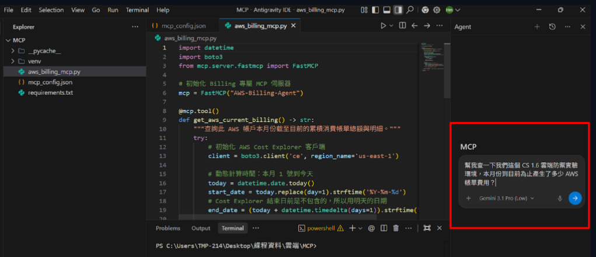
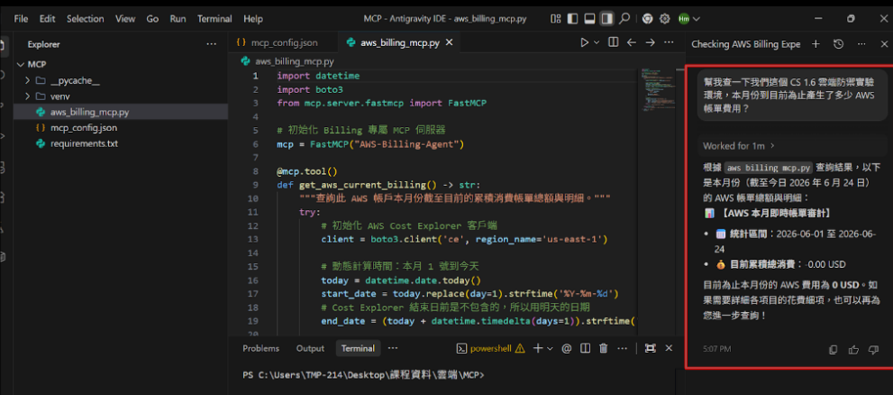

# 基於 AWS 雲端環境之 FPS 遊戲伺服器防禦、資安職責分離與惡意行為監控自動化系統

本專案以經典多人連線遊戲 Counter-Strike 1.6 (CS 1.6) 為實驗場景，建置了一套雲端原生 SecOps 自動化監控與防禦架構。針對公開伺服器面臨的拒絕服務攻擊 (DoS/DDoS) 痛點，達成秒級觸發自動化網路層剔除，並導入企業級 IAM 職責分離與 FinOps 財務維運治理。

##  專題核心痛點與解決方案
- **痛點**：惡意攻擊者透過工具發送密集 UDP 流量（Port 27015），導致遊戲伺服器高延遲（Lag）甚至斷線（Crash）。
- **解法**：部署 AWS 雲端原生監控，配合 CloudWatch Alarms 與本機自動化防禦腳本，在指標衝破閾值時，**1 秒內自動生成 iptables 剛性防禦規則**，實現秒級阻斷。

##  系統架構拓撲

透過 AWS 雲端服務，整合 EC2 遊戲主機、CloudWatch 監控、Lambda 自動化應變，並對接 MCP 財務治理大腦，打造兼具安全與維運效率的全面防禦架構。

---

##  核心功能展示流程 (Demo Steps)

### 1. 環境初始化與遊戲服務上線
在 AWS 上成功部署並配置 EC2 執行執行個體，取得公有 IP 建立服務，並確認客戶端遊戲玩家可正常連線進入 FPS 伺服器暢玩。
- **左圖**：EC2 控制台管理畫面，確認執行個體正常維運。
- **右圖**：玩家成功透過公有 IP 連入遊戲，延遲穩定。

| AWS EC2 雲端主機配置 | 客戶端成功連入遊戲畫面 |
| :---: | :---: |
|  |  |

### 2. 遭受密集連線攻擊與閾值觸發
當攻擊者發動密集 UDP 流量轟炸遊戲伺服器（Port 27015）時，監控系統與 CloudWatch 指標瞬間飆升，達到資安防禦觸發閾值。
- **左圖**：測試環境中模擬多重視窗發動連線轟炸（視窗三強力轟炸，視窗一即時監控）。
- **右圖**：AWS 指標精準捕捉到瞬間暴增的連線脈衝，衝破安全閾值。

| 多視窗環境模擬與攻擊發動 | 監控指標衝破防禦閾值 |
| :---: | :---: |
|  |  |

### 3. 秒級自動化網路層剔除 (SOAR 防禦)
一旦 CloudWatch Alarms 偵測到指標超標，燈號即刻跳轉為紅色 **🔴 In alarm**，並於 1 秒內在 Linux 核心自動生成剛性防火牆規則，徹底封鎖惡意來源，地端轟炸視窗瞬間翻盤（由綠轉紅，顯示阻斷）。
- **左圖**：AWS CloudWatch 控制台精準亮起紅色告警。
- **右圖**：地端防禦成功，系統自動套用 `REJECT` 規則，秒級阻斷惡意流量。

| AWS CloudWatch 進入告警狀態 | 地端防火牆規則秒級阻斷 |
| :---: | :---: |
|  |  |

---

##  企業級 IAM 資安職責分離
本系統嚴格遵循資安「最小權限原則（Least Privilege）」，在 AWS IAM 中將運維、資安審計與財務權限切分為三個獨立角色，杜絕權限濫用風險：
- **Game-Server-Admin (遊戲維運主管)**：僅具備管理 EC2 與遊戲伺服器權限。
- **Security-Analyst (資安分析師)**：僅具備讀取 CloudWatch Logs 與資安審計權限，確保日誌不可篡改，即便本機日誌遭黑客銷毀亦能進行數位鑑識。
- **FinOps-Manager (財務運維主管)**：僅具備 AWS Budgets 預算管控與帳務盤查權限。

---

##  前瞻 FinOps 治理 (MCP 整合)
專案前瞻性地整合了 **Model Context Protocol (MCP)** 架構與 AI 運維大腦。管理階層或財務主管無需點進繁瑣的 AWS 帳務後台，即可透過自然語言進行實時預算查詢與當月帳務趨勢預測。

- **左圖**：主管使用自然語言提問：「請幫我查詢目前的 AWS 雲端預算進度與超額告警狀態」。
- **右圖**：MCP 服務透過 API 即時分析 AWS Budget，並以結構化中文精準回報當前財務治理狀態。

| 主管自然語言發出 FinOps 盤查 | AI 大腦透過 MCP 給予精準財務回報 |
| :---: | :---: |
|  |  |
